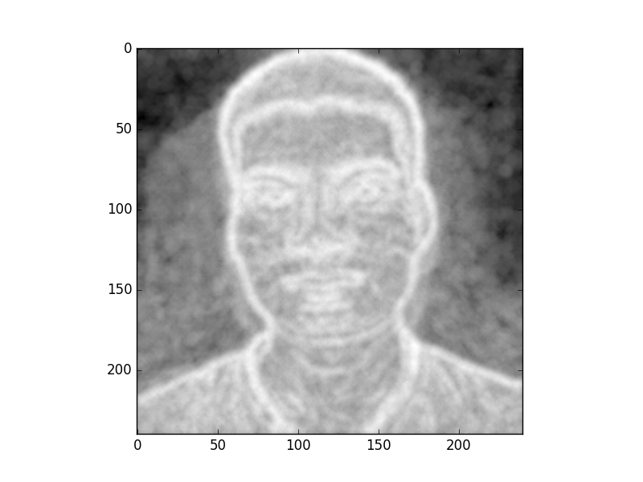
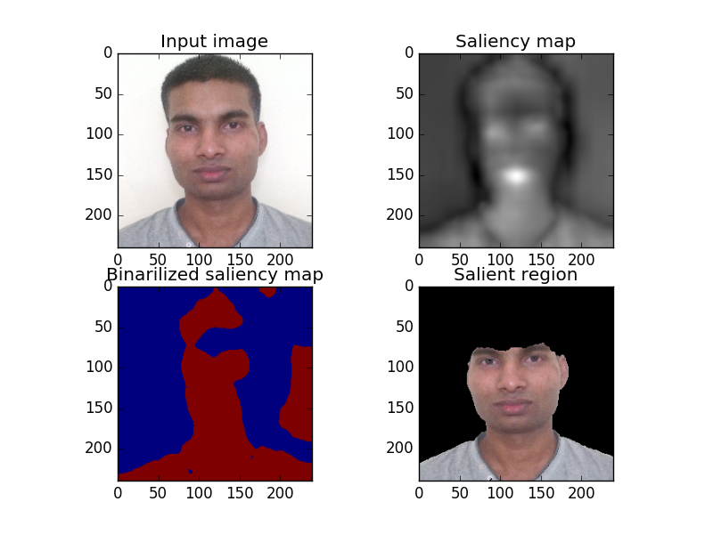

### How to run
`python database.py`

This script will ask for root of database and train all models. Training models are saved in **database** folder.

`python match_percentage.py`

This script will ask for root of testing database and show the cumulative success percentage.

`rgbd.py`
Contains function named **rgbd** which takes two arguments RGB image and depth map. Returns feature vector for that image

